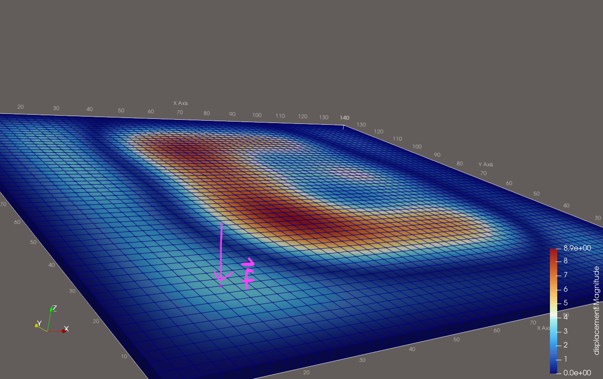
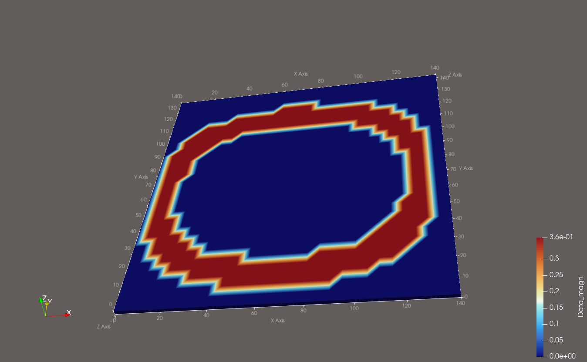

# RL4Science Praktikum

## Setup
*(This is for Unix based setups. For Windows adapt accordingly.)*

Create a conda env with Python 3.10.18 (jax-fem requires 3.10.18) with the `environment.yaml` in the project root:

```bash
conda env create -f environment.yaml
```

This installs python, all conda packages and pypi dependencies. It also installs jax and jaxlib with cpu support only, as the solver runs entirely on the cpu.

On WSL you might need to resolve a conflict with libGLU that conda can't handle:
```bash
sudo apt install -y libglu1-mesa libgl1-mesa-glx
```

If you end up needing torch for RL, feel free to reach out. It can be a little tricky to install alongside jax and sksparse in the same environment (OpenMP conflicts etc.).

## PDE
(Only read if interested)
We are considering the PDE of linear elasticity. This means the material property has a linear relationship between stress and strain.

**Important for you**: Intuitively, a change in external forces, which we apply, causes a proportional change in displacement of the plate. This can be useful to sanity check your RL agents actions.

Below is a quick overview of the maths involved (by no means rigorous; a ton of definitions are missing):

The PDE of linear elasticity is defined as
```math
\begin{cases}
{- \nabla \cdot \sigma} = f & \text{in } \Omega \\
\varepsilon = \frac{1}{2} (\nabla u + \nabla u^\top) & \\
\sigma = 2 \mu \varepsilon + \lambda \text{tr}(\varepsilon)\text{Id} & \\
u = 0 & \text{on } \partial \Omega_D.
\end{cases}
```

The weak form of the PDE, which we have implemented in jax-fem, reads:

$$
\int\limits_\Omega \sigma(\nabla u)\cdot \nabla v ~ dx - \int\limits_\Omega f\cdot v ~ dx - \int\limits_{\partial \Omega} \sigma(\nabla u) v \cdot n ~ ds = 0.
$$

Using the Finite Element Method, solving the above weak form amounts to solving $A u = f$,
where $A$ is the FEM matrix of the linear PDE operator and $f$ are the forces we prescribe. We would like to find the displacement function $u(x,y,z)$.

## Domain and Boundary Conditions
Our domain $\Omega \in \mathbb{R}^3$ is a 3d thin plate with the dimensions $140 \times 140 \times 2$ (mm). We set the displacement on all edges to be zero: $u = 0 \in \partial\Omega_D$. This means the edges are fixed in space and cannot be displaced/moved. This is necessary to make the problem mathematically well posed and therefore solvable.
We fix each mesh element to a hexagon of size $5 \times 5 \times 2$. This results in $28^2 = 784$ mesh elements and $(28 + 1)\cdot(28 + 1)\cdot2 = 1682$ nodes.

**All arrays containing mesh information, solutions, or forces are therefore of shape (1682, 3).** You can obviously reshape for convenience, e.g. to (29, 29, 2, 3) but solutions and the force fields you pass, have the above shape.

## Discrete Forces
We deform the plate into the desired shapes by pushing/pulling on the outside of the plate. In the discrete case, we have a force vector per node $`\vec{f}_i(x,y,z), i \in \{0,\dots,\text{no of nodes}\}`$ (after the domain is discretized with a mesh), that the agent can change. The `LinElasticityDisc` class should be used for discrete force applications.

<p align="center">
  
</p>

**Note**: Nodes that are fixed due to boundary conditions, i.e., the nodes on all edges, cannot be displaced by forces. The simulation handles this automatically but it may be helpful information to reduce the search space for the RL agent.

## Continuous Forces

Continuous Forces can be specified using the `LinElasticityCont` class. To apply forces with continuous positions, the agent can learn and change the following *force attributes*:

- $`(x, y, z)`$ position of the force vectors
- Force vector components $`(f_x, f_y, f_z)`$
- Radius of a circular area around the $`(x, y, z)`$ position

The force vectors are then evenly distributed among all nodes inside the circular area. Nodes in overlapping areas result in the forces being summed at those nodes. The agent can also change the total number of applied forces.

**Note that the gradients shape changes with varying numbers of forces.**

## Target Shapes

The target shapes (target displacements $`\hat{u}(x,y,z)`$) are letter imprints on the plate.

<p align="center">
  
</p>

**In the current implementation, the target letters have non-smooth boundaries/sharp edges. This makes it physically impossible to fit the target perfectly.** If you find that the agent takes a lot of time to improve the nodal forces along the edges, due to this property, it may help to apply Gaussian smoothing or something similar to the target letters.

You will find that some shapes are harder to optimize than others.


## Examples
We provided examples for manual problem creation and how to use convenience functions for quick and easy creation of problem instances and force fields. There are also examples on how differentiation of an objective function w.r.t. the forces works.

See `src/example_disc_forces.py` and `src/example_cont_forces.py` for details. Run the example functions to get an overview of the utilities by executing

```bash
JAX_ENABLE_X64=True python src/example_disc_forces.py
JAX_ENABLE_X64=True python src/example_cont_forces.py
```


## Viewing Results
The easiest and best way to visualize your results is by installing [Paraview](https://www.paraview.org/download/) and converting the `jax.Array` meshes to vtk files.
There is a convenience function for this exact purpose in `src/postprocessing.py`.

Paraview interpolates discrete functions over the given meshgrid so you always get a nice continuous displacement $u(x,y,z)$.

Do the following:

1. Open the vtk file from Paraview (top left).
2. In the Pipeline browser click on the file and then click `Apply` in the Properties below.
3. In the Coloring section of the Properties browser, you can select `U` to be displayed from the dropdown menu and choose whether to display the displacement vector magnitude, x, y, or z component.

If you'd like to see the actual displacement instead of just a heatmap, you can right click on the file in the Pipeline Browser, select `Add Filter` and from the filter list choose `Warp by Scalar`/`Warp by Vector`. The warped solution field can then be selected from the Pipeline Browser.

## Quick Note on Numerical Stability
FEM solvers don't care if the given forces etc. are physically feasible. As long as the matrix $A$ and the resulting system of linear equations are well defined, they solve the system and compute the corresponding displacements. Meaning, if your agent suggests e.g. very large forces, it might blow up the simulation in the sense that the resulting displacements become similarly large.
A good sanity check is that because of linearity, the following holds $\vec{u} \approx \frac{\vec{f}}{E}$, where $E$ is the Young's Modulus (material stiffness). In our case $E=200$. Also, in the domain of linear elasticity, out-of-plane displacements should be $`<20\%`$ of plate thickness, which in our case is $2$, so at most $0.4$ displacement in z-direction.

## Important Caveats
FEM solvers require double precision floats in most cases for numerical precision, so make sure forces are always `float64`. Jax only uses `float64` if explicitly stated,
so either set `jax.config.update("jax_enable_x64", True)` at the top of your entry point before importing jax or pass `JAX_ENABLE_X64=True` as env var when running your scripts:
```bash
JAX_ENABLE_X64=True python src/example_disc_forces.py
JAX_ENABLE_X64=True python src/example_cont_forces.py
```

In jax it is commonly possible to jit-wrap a function which compiles the xla-computational graph and speeds up computation. This is **not** possible here, because solving the adjoint method contains external function calls (e.g. sksparse cholesky solver). Forward- and backward-pass are still very fast.
